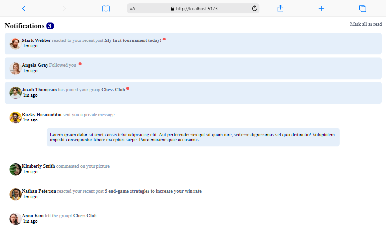

# Página de  notificação
* Desafio front-end mentor
* Praticando meus conhecimentos básicos em React.

## O que eu usei nesse desafio
Para resolver esse desafio, utilizei React e o conceito de components, helpers e styled-components

## Como utilizei
* Primeiro instalei o vite
* Criei um componente para exibir todas as notificações. Para isso utizei Props para que os valores fossem dinâmicos.
* Criei um helper com os dados de cada usuario, e depois importei na páginei principal e usei nos components.

## Instalação
    npm install

## Rodando projeto
    npm run dev

## Imagem do Desafio
